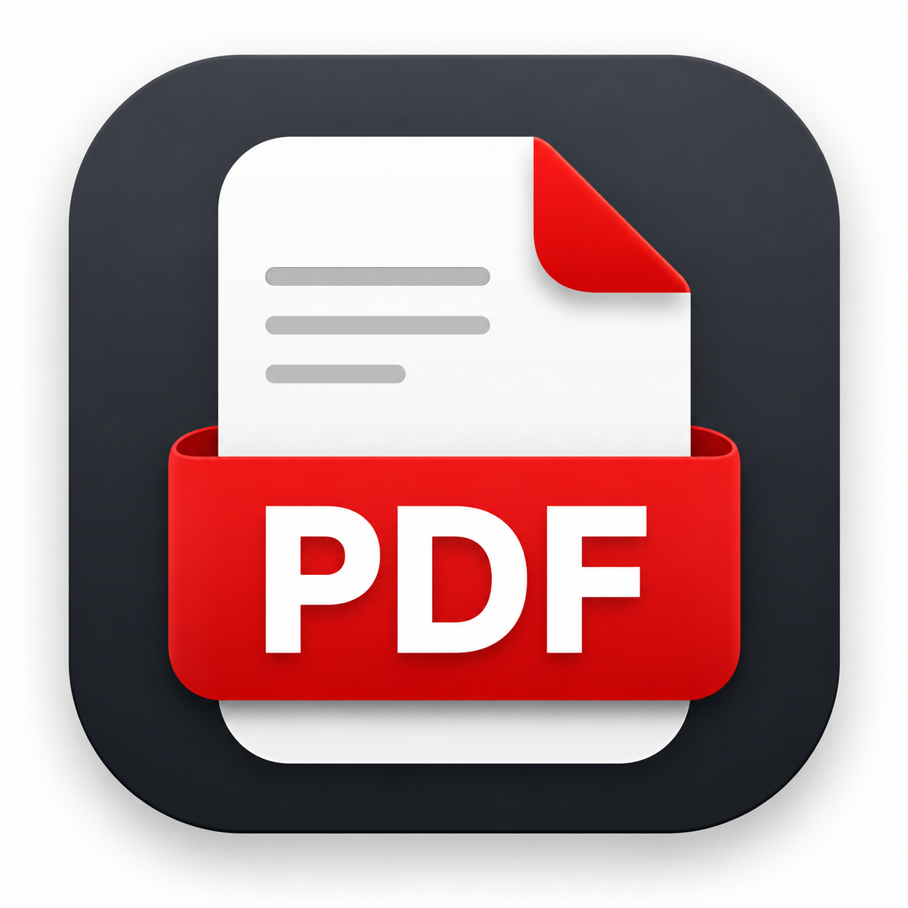

<div align="center">
  

  # PDF Studio

  **Gộp PDF và chuyển PDF sang ảnh ngay trên máy tính Windows — nhanh, riêng tư, không làm giảm chất lượng trang.**

  [](https://github.com/datdtpl-maker/PDF-Studio/releases)
  [](https://github.com/datdtpl-maker/PDF-Studio/releases/latest)
  [](https://github.com/datdtpl-maker/PDF-Studio/actions/workflows/ci.yml)

  [**Tải bản cài đặt Windows**](https://github.com/datdtpl-maker/PDF-Studio/releases/latest)
</div>


## Tính năng

- **Gộp nhiều PDF:** thêm nhiều file, kéo thả hoặc dùng nút lên/xuống để sắp xếp.
- **Giữ nguyên chất lượng:** trang PDF được sao chép trực tiếp, không raster hóa hoặc tái nén.
- **PDF sang ảnh:** xuất từng trang thành PNG, JPG hoặc WebP.
- **Tùy chọn độ phân giải:** 96, 150 hoặc 300 DPI.
- **Tải ảnh gọn gàng:** toàn bộ ảnh được đóng gói tự động vào một file ZIP.
- **Xử lý cục bộ:** file không được tải lên máy chủ và không rời khỏi thiết bị.
- **Giao diện responsive:** sử dụng tốt trên nhiều kích thước cửa sổ, hỗ trợ bàn phím và reduced motion.

## Định dạng hỗ trợ

| Chức năng | Đầu vào | Đầu ra |
|---|---|---|
| Gộp tài liệu | Nhiều file PDF | Một file PDF |
| Chuyển sang ảnh | Một file PDF | PNG, JPG hoặc WebP trong ZIP |

## Cài đặt trên Windows

1. Mở trang [Releases](https://github.com/datdtpl-maker/PDF-Studio/releases/latest).
2. Tải `PDF-Studio-Setup-1.0.1.exe`.
3. Mở bộ cài, chọn thư mục và bấm **Install**.
4. Khởi chạy **PDF Studio** từ Desktop hoặc Start Menu.

> [!NOTE]
> Bộ cài hiện chưa có chứng thư code-signing thương mại. Nếu Windows SmartScreen hiển thị **Unknown publisher**, chọn **More info → Run anyway**.

## Quyền riêng tư

PDF Studio không có backend xử lý tài liệu. Các thao tác đọc, gộp, render trang và tạo ZIP đều chạy trong tiến trình ứng dụng trên máy của bạn.

- Không upload tài liệu.
- Không yêu cầu tài khoản.
- Không lưu bản sao PDF vào máy chủ.
- Không tích hợp analytics hoặc tracking.

## Chạy từ source

### Yêu cầu

- Windows 10/11 x64
- Node.js 22 trở lên
- pnpm 11 trở lên

### Khởi động bản web

```powershell
pnpm install
pnpm dev
```

### Kiểm tra chất lượng

```powershell
pnpm test
pnpm lint
pnpm build
```

### Build bộ cài Windows

```powershell
pnpm desktop:build
```

Bộ cài NSIS và bản portable unpacked được tạo trong thư mục `release/`.

## Công nghệ

- React + TypeScript + Vite
- Electron
- PDF.js
- pdf-lib
- JSZip
- electron-builder + NSIS

## Cấu trúc chính

```text
electron/       Electron main process và chính sách cửa sổ an toàn
public/         Icon và tài nguyên tĩnh
scripts/        Công cụ tạo icon Windows
src/components/ Thành phần giao diện
src/lib/        Xử lý PDF, ảnh và tải file
docs/           Ảnh minh họa cho tài liệu
```

## Giới hạn hiện tại

- PDF có mật khẩu cần được mở khóa trước khi xử lý.
- Chữ ký số không được bảo toàn sau khi gộp.
- Bookmark cấp tài liệu có thể không được chuyển sang file gộp.
- Xuất tài liệu dài ở 300 DPI có thể cần nhiều RAM.

## Báo lỗi và đề xuất

Vui lòng tạo [GitHub Issue](https://github.com/datdtpl-maker/PDF-Studio/issues) kèm phiên bản Windows, phiên bản PDF Studio và các bước tái hiện lỗi. Không đính kèm tài liệu nhạy cảm.
